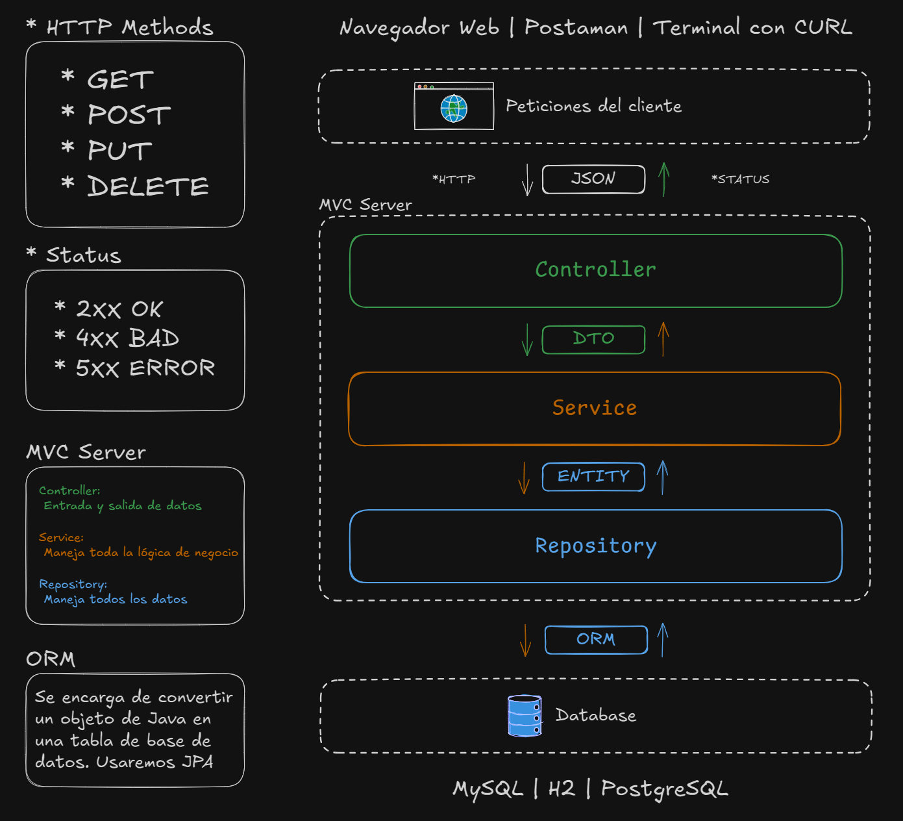

# Código del curso Java Backend - Talent Tech

## Practicas
Revisa la carpeta de prácticas!

## Estructura de carpetas
```
java-base/
└── src/.../
    ├── clases/
    ├── prácticas/
    └── proyecto/
spring-boot/
├── clase x1/
│   ├── teoría/
│   └── práctica/
├── clase x2/
│   ├── teoría/
│   └── práctica/
└── clase n....
```

## Arquitectura para Spring boot
